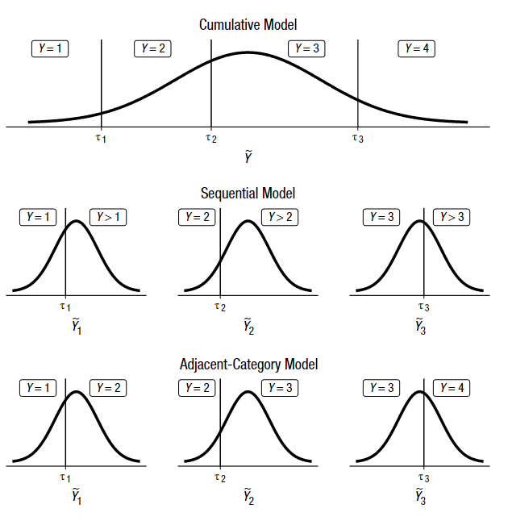

```{r setup, include = FALSE}
knitr::opts_chunk$set(echo = FALSE,
                      dev = "pdf",
                      fig.align = "center",
                      size = "scriptsize",
                      message = FALSE,
                      warning = FALSE)
```

```{r hooks, include = FALSE}
def.chunk.hook  <- knitr::knit_hooks$get("chunk")
knitr::knit_hooks$set(chunk = function(x, options) {
  x <- def.chunk.hook(x, options)
  ifelse(options$size != "normalsize", paste0("\n \\", options$size,"\n\n", x, "\n\n \\normalsize"), x)
})
```

```{r packages, include = FALSE}
library(tidyverse)
library(ordinal)
library(here)
library(flextable)
library(cowplot)
library(viridis)
devtools::load_all()
```

```{r funs, include = FALSE}
funs <- filor::get_funs(here("R", "utils.R"))
```

```{r ggplot, include = FALSE}
mtheme <- function(){
  ggthemes::theme_pander(15) +
    theme(legend.position = "bottom",
        plot.title = element_text(hjust = 0.5),
        strip.text = element_text(face = "bold"),
        panel.grid.minor = element_blank())
}

theme_set(mtheme())

# palettes
options(ggplot2.continuous.colour="viridis")
options(ggplot2.continuous.fill = "viridis")
scale_color_discrete <- scale_colour_viridis_d
scale_fill_discrete <- scale_fill_viridis_d
```

```{r include = FALSE}
# figures
source(here("scripts", "figures.R"))
rfigs <- readRDS(here("objects", "r-figs.rds"))
```

```{r tables, include=FALSE}
mtab <- function(data){
  
}
```


# Introduction

Psychological research make an extensive use of ordinal data. One of the main reason is probably the usage of Likert scales [@Likert1932-xw]. Ordinal data refers to a specific type of measurement scale [@Stevens1946-te] where ordered numbers are assigned to a variable. Compared to nominal scale and as the name suggest the labels are ordered. Compared to interval or ratio scales there is no explicit assumption about the distance between labels. (rivedi questo). An example is asking people the degree of agreement about a certain statement using a scale from 1 (no agreement) to 7 (total agreement). Answering 4 compared to 2 suggest an higher agreement but we cannot affirm that there is two times the agreement compared to the second answer. @Stevens1946-te and @Kemp2021-dj suggested that for ordinal variables is appropriate to calculate ranks-based statistics (e.g., median or percentiles) instead of metric statistics (e.g., mean or standard deviation). This distinction in terms of the appropriateness of certain descriptive statistics is also relevant when modeling data. Treating ordinal data as metric refers to assuming the labels as actual integer numbers thus assuming a fixed and know distance between levels [@Liddell2018-wu].

In Psychology especially when using item-based measures (questionnaires, surveys, etc.) the common practice is using a normal linear regression that makes an explicit assumption about metric features of the response variable. @Liddell2018-wu reviewed the psychological literature using likert-based measures and reported how the majority of papers used metric-based statistical models. In the same work, @Liddell2018-wu showed extensive examples and simulations about the potential pitfalls of treating an ordinal variable as metric [but see @Robitzsch2020-la for an alternative perspective]. They reported problems in terms of lack of power, inversion of the effects and distortion in estimating the effect size (rivedi meglio qui). (vedi se c'è qualche altro lavoro che fa vedere questa cosa). Some authors suggested that despite individual items being ordinal, averaging multiple items could solve the problem of applying metric models (e.g., Carifio & Perla, 2007, 2008 metti queste citazioni). @Liddell2018-wu suggested that in some conditions even averaging multiple items and applying metric models could be problematic. @Cliff2016-ck suggest that most of the research questions in behavioral sciences can be considered as ordinal (*is the score $x$ higher than the score $y$*?) concerning variables where the most appropriate measurement scale is probably ordinal.

qualcosa ancora qui

## Ordinal regression models

Despite the actual modeling proposal by @Liddell2018-wu, there is a class of regression models taking into account the ordinal nature of the response variable without making metric assumptions. We can class this general class of models as *ordinal regression*. The nomenclature of these models can be confusing mainly because there are several subclasses of models with different assumptions and structures [@Tutz2022-dg]. @Tutz2022-dg and @Burkner2019-aw provide a clear and updated taxonomy of ordinal regression models. We can identify three main classes: *cumulative models* [@McCullagh1980-cw], *sequential models* [@Tutz1990-fe] and *adjacent category models*. The cumulative is the mostly used model assuming the existence of a latent variable that when segmented using thresholds produces the observed ordinal variable. The psychological process underlying the response is clearly formalized in the signal detection theory framework where the respondent (vedi come sistemare). The sequential model as suggested by the name is appropriate when modelling sequential processes. Assuming to have 5 response options, the sequential model assume that responding 3 means already reaching the states 1 and 2. A clear example is proposed by @Burkner2019-aw where the marriage duration in years is predicted as a function of some explanatory variables. For each level of the response variable there is a latent distribution where the step between a marriage year $k = 1$ and the next years $k > 1$ is modeled by the sequential regression. When comparing $k$ with $k > 1$, everything lower than $k$ is assumed to be already reached [@Tutz2020-xq]. The adjacent category model compare the category $k$ with $k + 1$ still assuming a latent distribution for each $k$. As suggested by @Tutz2022-dg the adjacent-category model can be seen as a series of binary binomial regressions taking into account the order of the categories. @Burkner2019-aw suggested that adjacent-category model can be chosen for its mathematical convenience and there is no a clear empirical distinction as for the cumulative vs sequential model. 

In the current paper we put the focus on the cumulative model for several reasons. The first reason is that the latent formulation of the model is particularly convenient both for parameter interpretation and data simulation. The second reason is that several psychological variables can be formalized as a latent continuous construct that when measured is collected using ordinal items. Furthermore, also the signal detection theory framework models the decision process assuming a latent distribution for the signal and noise where thresholds are the response criteria [e.g., @DeCarlo2010-lj].

```{r fig-ordinal-models, fig.cap=filor::get_caption(), out.width="100%"}

```

## Model notation

metti qualcosa sulla nomenclatura

> The name, cumulative link models is adopted from Agresti (2002), but the model class has
been referred to by several other names in the literature, such as ordered logit models and
ordered probit models (Greene and Hensher 2010) for the logit and probit link functions. The
cumulative link model with a logit link is widely known as the proportional odds model due
to McCullagh (1980) and with a complementary log-log link, the model is sometimes referred
to as the proportional hazards model for grouped survival times.

In this section we introduce some notations for the cumulative model that is used through the paper and in the R code. The notation is as consistent as possible with the main textbooks and with the `ordinal` R package used in the tutorial. We define $Y_k$ as the observed ordinal response with $1, 2, \dots,k$ options and $Y^\star$ is the corresponding latent variable. The latent variable is segmented using $k - 1$ thresholds $\alpha_1, \alpha_2, \dots, \alpha_{k - 1}$. With $g()$ we define the cumulative probability function assumed for the specific model. For example, when using a Gaussian distribution we are fitting a model with a `probit` link function thus $f() = \Phi()$. With $g^{-1}()$ we define the inverse of the cumulative probability function. The minus sign in $\mathbf{X}\mathbf{\beta}$ is used to give the usual interpretation of standard regression models where an increase in $\beta$ corresponds to an increase in the probability of higher categories of $Y$ (metti il libro di agresti sui dati ordinali).

\begin{equation} 
P(Y \leq k) = g(\alpha_k - \mathbf{X} \mathbf{\beta}), \;\;k = 1, 2, \dots, k
(\#eq:prob-cum-model1)
\end{equation}

We can call the $\mathbf{X}\mathbf{\beta}$ as the linear predictor $\eta$. Equation (num) describe how the probability of a single outcome $Y_k$.

\begin{equation} 
P(Y = k) = g^{-1}(\alpha_k - \eta) -  g^{-1}(\alpha_{k - 1} - \eta)
(\#eq:prob-cum-model2)
\end{equation}

<!-- notazione https://people.vcu.edu/~dbandyop/BIOS625/CLM_R.pdf e @Burkner2019-aw per la parte di notazione e quella più formale anche @DeCarlo2010-lj -->

The same model can be formalized using the latent formulation (see Equation). This is more similar to a standard linear regression.

\begin{equation} 
Y^\star_i = \eta + \epsilon_i
(\#eq:latent-model)
\end{equation}

Where $\epsilon$ is the error part and comes from the distribution that is assumed from the latent model. For a *probit* model, errors are sampled from a standard Gaussian distribution while for a *logit* model from a standard logistic distribution. Then the observed ordinal value $Y_i$ comes from $Y^\star_i$ being between the thresholds $\alpha_{k - 1} < Y^\star_i < \alpha_{k}$ with thresholds organized as $- \infty \equiv \alpha_1 < \dots< \alpha_{k - 1} < \alpha_k \equiv \infty$. <!-- TODO rivedi questa -->

In the basic version of the model, the thresholds $\alpha$ are considered as fixed and do not vary as a function of predictors. The thresholds are part of the measurement procedure [@Liddell2018-wu]. In a more sophisticated version of the model called location-shift [@Tutz2022-dg], both the location $\mu$ and the thresholds $\alpha$ can vary as a function of the predictors. In the following sections another version of the model called location-scale [@Tutz2022-dg; @Rigby2005-ko; @Cox1995-ur] will be presented as a more flexible way to model latent distributions with heterogeneous variance (spiega meglio).

## lm on latent vs ordinal

as suggested https://people.vcu.edu/~dbandyop/BIOS625/CLM_R.pdf, running a lm on the latent variables gives similar parameter as the clm. Of course, we are able to do this with real data given that the ordinal variable is the observed version of an unobserved latent variable. But in simulation this is useful to understand what the cumulative model is doing.

```{r}
dat <- data.frame(
  x1 = rnorm(1e5),
  x2 = rnorm(1e5)
)

dat <- sim_ord_latent(~x1 + x2, By = c(1, 0.5), probs = rep(1/5, 5), link = "probit", data = dat)

fit <- lm(ys ~ x1 + x2, data = dat)
summary(fit)

clm(y ~ x1 + x2, data = dat, link = "probit")
coef(fit)/sigma(fit)
```

## Kruscke parametrization

@Liddell2018-wu and @Kruschke2015-re proposed an alternative parametrization to understand the model parameters. They used a probit model where thresholds and regression parameters are estimated on the scale of the ordinal variable compared to standard ordinal regression where they refers to the quantile of the latent variables for the threshold and z score or odds ratio for the regression coefficients. They implemented the model in Jags and provided some equations and R functions to convert from the standard parametrization to the proposed one.

The proposed model is fitted within a Bayesian framework using either Jags (citation) or Stan (citation). Kruskche proposed a simple method to convert the parameters fitted with a standard model within the proposed parametriazion. The main improvement regards mapping the values (for thresholds $\alpha_i$ and slopes $\beta$) from latent standard distribution (gaussian or logistic) into the scale of the $y$ ordinal value. The scale of the variable depend on the numeric labels assigned to ordered categories. There is an additional feature of the proposed parametrization where the first and the last thresholds are fixed respectively to $\alpha_1 + 0.5$ and $\alpha_k - 0.5$ where other thresholds are estimated.

@Kurz2023-zv explain how to convert a model fitted with the `brms` package (citation) (an R package for regression modeling using *stan*) into the Kruschke [-@Kruschke2015-re] parametrization.

Using the function proposed by @Kruschke2015-re (metti ref ad osf) and the equations presented in @Kurz2023-zv the `clm_to_ord()` function convert parameters fitted with the `clm` function into the corresponding parameters for the latent $Y^\star$ variable considering the actual range of values (from 1 to $k$).

```{r, echo=FALSE, results='asis'}
filor::print_fun(funs$clm_to_ord)
```

```{r}
#| echo: true

dat <- data.frame(
  x = rnorm(1e5)
)

dat <- sim_ord_latent(~x, By = 1, probs = rep(1/5, 5), link = "probit", data = dat)
fit <- clm(y ~ x, data = dat, link = "probit")
clm_to_ord(fit)
```

## Gelman parametrization

rivedi questa parametrizzazione in @Gelman2020-tg

```{r}
#| eval: false
dat <- data.frame(x = runif(1e5, 0, 1))
dat <- sim_ord_latent(~x, By = 2, probs = c(0.5, 0.2, 0.1, 0.1, 0.1), data = dat, link = "logit")
fit_clm <- clm(y ~ x, data = dat, link = "logit")

num_latent_plot(dat$x, 2, probs = c(0.5, 0.2, 0.1, 0.1, 0.1), link = "logit")

summary(fit_clm)

ths <- -(fit_clm$alpha/fit_clm$beta)
betas <- 1/fit_clm$beta

dat <- cbind(dat, dummy_ord(dat$y))

fit <- glm(y1234vs5 ~ x, data = dat, family = binomial(link = "logit"))

coefs <- coef(fit)

x <- seq(0, 1, 0.01)

plot(x, plogis(coefs[1] + coefs[2] * x), type = "l")


-(fit_clm$alpha/fit_clm$beta)
1/fit_clm$beta

```

# Interpreting parameters

## Odds and odds ratio

una piccola spiegazione di odds e odds ratio

## Proportional odds assumption

Following again the taxonomy by @Tutz2022-dg, each of the presented ordinal regression model has a basic version making the  proportional odds assumption. There are more advanced versions of the model relaxing this assumption completely (*non proportional odds* models) and partially (*partial proportional odds* models) (rivedi se la nomenclatura va bene). The proportional odds assumption is a crucial point when intepreting model parameters. Can be formalized as in Equation (). Basically if we use the *logit* link function $g()$ the $\beta$s are interpreted as standard odds ratio in the logistic regression. Given that we have $k > 2$ alternatives there is the need of $k - 1$ equations (as reported in Equation ()). The porportional odds is assuming that the regression coefficients $\beta$ are independent from the thresholds $\alpha$ thus the effect is the same regardless of the $Y$ level. Thus $\beta_1 = \beta_2 \dots = \beta_{k - 1}$. The Figure () depicts the proportional odds assumption for the $k - 1$ logistic curves both for probabilities and linear predictors $\eta$.

```{r fig-prop-odds, fig.cap=filor::get_caption()}
rfigs$fig_prop_odds
```

The proportional odds assumption is convenient because regardless the number of $k$, the $\beta_j$ ($j$ being the number of regression coefficients) effect is assumed to be the same. The model is more parsimonious compared to estimating $k - 1$ coefficients for each $\beta_j$ as in the multinomial regression or the non-proportional version of the ordinal regression. Clearly this can be a strong assumption in some conditions. There are several methods to test the proportional odds assumption [see @Liu2023-bp for an overview]. @Tutz2020-xq suggested that using alternative as the location-shift or location-scale models, the assumption can be made (improving model parsimony) but still having a more flexible modeling framework. In the next section, we provide more details about the location-scale model in terms of parameters interpretation and data simulation.

To make a practical example, the dataset presented in Table contains simulated data from $n = 100$ participants rating the agreement about a certain item with $k = 4$ ordered options. The participants are divided into two groups (predictor $x$). We want to fit a cumulative ordinal model and check the proportional odds assumption.

<!-- - https://hbiostat.org/ordinal/impactpo.pdf blog su proportional odds, mi pare di capire che non sia così problematica come assunzione -->

```{r}
b1 <- log(3) # log odds ratio
k <- 4
n <- 100
x <- rep(c("a", "b"), each = n/2)
dat <- data.frame(x = x)
probs <- rep(1/k, k) # for the group "a", uniform probabilities
dat <- sim_ord_latent(~x, By = b1, probs = probs, data = dat, link = "logit")
fit <- clm(y ~ x, data = dat, link = "logit")
pr <- predict(fit, data.frame(x = unique(x)))$fit
```

Basically the proportional odds suggest that:

$$
\text log(\frac{P(y \leq 1)}{P(y > 1)})
$$

Is the same regardless the level of the $x$ predictor. Thus:

$$
\text{log}\left(\frac{\frac{P(y \leq 1|x_0)}{P(y > 1|x_0)}}{\frac{P(y \leq 2|x_0)}{P(y > 2|x_0)}}\right) = \text{log}\left(\frac{\frac{P(y \leq 1|x_1)}{P(y > 1|x_1)}}{\frac{P(y \leq 2|x_1)}{P(y > 2|x_1)}}\right)
$$

```{r}
#| echo: true
a_or1vs2345 <- filor::odds(pr[1, 1]) # 1 vs 2 3 4 5
a_or12vs345 <- filor::odds(sum(pr[1, 1:2])) # 1 vs 2 3 4 5

b_or1vs2345 <- filor::odds(pr[2, 1]) # 1 vs 2 3 4 5
b_or12vs345 <- filor::odds(sum(pr[2, 1:2])) # 1 vs 2 3 4 5

c(xa = log(a_or1vs2345 / a_or12vs345), xb = log(b_or1vs2345 / b_or12vs345))
```

Proportional odds can be also visualized by plotting the cumulative probabilities of $y$, in terms of $g(P(y \leq j))$ (where $g()$ is the logit link function) as a function of the predictor $x$. If the proportional odds assumptions holds the slopes are parallel (also known as parallel regression assumption). The Figure \@ref(fig:poa-plot-example) depicts the assumption of proportional odds in the probability and logit space.

```{r poa-plot-example, fig.cap="POA assumption"}
k <- 5 # number of levels for y
grid <- data.frame(x = seq(0, 1, 0.1)) # numeric predictor
probs <- get_probs(~x, 5, rep(1/k, k), data = grid, link = "logit") # probabilities
cprobs <- apply(probs, 1, cumsum, simplify = FALSE)
cprobs <- data.frame(do.call(rbind, cprobs))
names(cprobs) <- sprintf("y<=%s", 1:k)
cprobs <- cprobs[, -ncol(cprobs)] # remove the last
grid <- cbind(grid, cprobs)

grid <- grid |> 
  pivot_longer(starts_with("y")) |> 
  mutate(lp = qlogis(value))

poa_probs_plot <- grid |> 
  ggplot(aes(x = x, y = value, color = name)) +
  geom_line() +
  theme_minimal(15) +
  theme(legend.position = "bottom",
        legend.title = element_blank(),
        axis.title.y = element_blank()) +
  ggtitle("Probability")

poa_lp_plot <- grid |> 
  ggplot(aes(x = x, y = lp, color = name)) +
  geom_line() +
  theme_minimal(15) +
  theme(axis.title.y = element_blank()) +
  ggtitle("Linear Predictor")

bl <- cowplot::get_legend(
  poa_probs_plot
)

poa_plot <- cowplot::plot_grid(
  poa_probs_plot + theme(legend.position = "none"),
  poa_lp_plot + theme(legend.position = "none")
)

cowplot::plot_grid(poa_plot, bl, ncol = 1, rel_heights = c(0.9, 0.1))
```

@Harrell-2015-no proposed a very intuitive plot to assess the proportional odds assumption and eventually the degree of deviation from the ideal case. Basically predictor is plotted against the logit of the cumulative probability. Distances between pairs of symbols should be similar across levels of the predictors. Numerical predictors can be binned before plotting the corresponding logit. Figure \@ref(fig:harrel-poa-plot) depicts an example with simulated data satisfying the proportional odds assumption.

```{r harrel-poa-plot, fig.cap="Harrel Poa Plot"}
k <- 5 # number of levels for y
grid <- data.frame(x = seq(0, 1, 0.1)) # numeric predictor
probs <- get_probs(~x, 5, rep(1/k, k), data = grid, link = "logit") # probabilities
cprobs <- apply(probs, 1, cumsum, simplify = FALSE)
cprobs <- data.frame(do.call(rbind, cprobs))
names(cprobs) <- sprintf("y<=%s", 1:k)
cprobs <- cprobs[, -ncol(cprobs)] # remove the last
grid <- cbind(grid, cprobs)

grid <- grid |> 
  pivot_longer(starts_with("y")) |> 
  mutate(lp = qlogis(value))

grid |> 
  ggplot(aes(x = lp, y = x)) +
  geom_point(aes(color = name, 
                 shape = name),
             size = 3) +
  theme_minimal(20) +
  xlab("Logit") +
  theme(legend.position = "bottom",
        legend.title = element_blank())
```

From a statistical point of view, the proportional odds assumption can be assessed by fitting $k - 1$ binomial regressions and checking if the estimated $\beta$ is similar between regressions. The regressions are estimated by creating $k - 1$ dummy variables from the ordinal $y$. The code below show that simulating data with the proportional odds create $k - 1$ binomial regression with similar $\beta$s. In fact, fitting $k - 1$ binomial regressions can be considered also an alternative to fitting an ordinal regression [see @Gelman2020-tg] with more flexibility in parameters (there will be $k - 1$ regression coefficients instead of a single one) but losing the latent intepretation (magari qualcosa di più qui).

```{r}
#| echo: true
k <- 4
n <- 1e5
dat <- data.frame(
  x = runif(n)
)

dat <- sim_ord_latent(~x, By = 5, probs = rep(1/k, k), data = dat, link = "logit")

# create dummy variables

dat$y1vs234 <- ifelse(dat$y <= 1, 1, 0)
dat$y12vs34 <- ifelse(dat$y <= 2, 1, 0)
dat$y123vs4 <- ifelse(dat$y <= 3, 1, 0)

fit1vs234 <- glm(y1vs234 ~ x, data = dat, family = binomial(link = "logit"))
fit12vs34 <- glm(y12vs34 ~ x, data = dat, family = binomial(link = "logit"))
fit123vs4 <- glm(y123vs4 ~ x, data = dat, family = binomial(link = "logit"))

car::compareCoefs(fit123vs4, fit12vs34, fit1vs234)
```


spiegare qui la differenza tra proportional and non proportional odds @Tutz2020-xq.

## Logit vs Probit model

When fitting an ordinal regression the two mostly used link functions are the *probit* and *logit*. From the distribution point of view the two functions are very similar. The *probit* model is based on a cumulative Gaussian distribution while the *logit* model is based on a logistic distribution. Figure \@ref(fig:logit-vs-probit) depict the two cumulative distributions.

```{r logit-vs-probit, fig.cap="Logit vs Probit"}
par(mfrow = c(1,2))

# density

curve(dnorm(x), -5, 5, lwd = 2, ylab = "Density", main = "Probability Density", cex.lab = 1.2, cex.axes = 1.2)
curve(dlogis(x), -5, 5, lwd = 2, col = "firebrick", add = TRUE)

# cdf

curve(pnorm(x), ylim = c(0, 1), xlim = c(-5, 5), y = "Probability", lwd = 2, main = "Cumulative Probability",
      cex.lab = 1.2, cex.axes = 1.2)
curve(plogis(x), ylim = c(0, 1), xlim = c(-5, 5), y = "Probability", col = "firebrick", lwd = 2, add = TRUE)
```

Given the different underlying distribution, the parameters have a different interpretation under the two models. The probit model assume a latent standard normal distribution with and $\sigma = 1$. The logit model assume a logistic distribution with $\sigma^2 = \pi^2/3$. Thus regression coefficients $\beta$ represents the increase in standard deviations units. The interpretation in terms of latent distribution is particularly useful for the probit model where $\beta$s can be interpreted in a Cohen's $d$ like manner. Furthermore, there is the possibility to directly map parameters from signal detection theory [@Stanislaw1999-jr; @Green1966-gy] into an ordinal probit regression. In practical terms, the thresholds are the criterion cut-offs and the $\beta_1$ is the d$'$ parameter [@DeCarlo1998-ay; @Knoblauch2012-to].

The latent formulation of the ordinal regression model allow to think in standard linear regression terms for choosing and interpreting model parameters before converting into the probability space. Both the standard Normal and the logistic distribution are defined with a location ($\mu$) and a scale ($s$) parameter. For the Normal distribution, $\mu$ is the mean and scale is the variance ($\sigma^2$). For the logistic distribution the variance is $\sigma^2=\frac{s^2\pi^2}{3}$. Thus fixing $\mu$ and $\sigma^2 = 1$ (the default), the two distributions are similar with the logistic having more variance. For this reason, the latent formulation for parameter intepretation is particularly useful for the probit model because the $\beta$ is directly interpreted in standard deviaton units that by default are fixed to 1. With a binary predictor $x$, $\beta$ is the shift of the latent distribution increasing $x$ by one unit. This can be directly interpreted as a standardized mean difference effect size (e.g., Cohen's $d$). This is the same for the logistic distribution but a unit increase in $x$ shift the latent distribution by $\sigma = \sqrt{\frac{s^2 \pi^2}{3}} = \frac{s\pi}{\sqrt{3}}$.^[In the case of a standard logistic distribution ($s^2 = 1$), the standard deviation is $\frac{\pi}{\sqrt{3}}$].

## Simulating data

There are mainly two ways to simulate data. The first method concerns simulating starting from the latent formulation of the ordinal model. Basically we can simulate the underlying latent distribution and then fixing the thresholds converting the latent continuous variable into the observed ordinal variable.

### simulating using probabilities

The first method to simulate ordinal data as a function of predictors is by calculating the true probabilities $g^{-1}(\eta)$ as a function of predictors and then sample from a multinomial distribution. This is similar to the general method to simulate data for a generalized linear model where the linear predictors $\eta$ are calculated and data are generated from the corresponding probability distribution of the random component. The following code box simulate a $n$ binary trials with a continuous predictor $x$.

```{r}
xl <- seq(0, 1, 0.1)
x <- rep(xl, 10)
n <- length(x)
b0 <- qlogis(0.01)
b1 <- 8
lp <- b0 + b1 * x # linear predictor
y <- rbinom(n, 1, plogis(lp)) # sampling from a binomial distribution using the vector of probabilities
p <- tapply(y, x, mean)
plot(unique(x), p, pch = 19)
curve(plogis(x, -(b0/b1), 1/b1), add = TRUE, lwd = 2, col = "firebrick")
```

We can apply the same idea to an ordinal outcome but we need $k - 1$ equations where $k$ is the number of ordinal levels. Let's simulate a similar design with a continuous $x$ predictor and $k = 4$ options. We fix the baseline probabilities where $x = 0$ as uniform thus $p(y_1) = p(y_2) = ... p(y_k) = 1/k$. The general workflow for the simulation is:

1. Define $n$ (number of observations) and $k$ (number of ordinal outcomes)
2. Define the regression coefficients $\beta$s
3. Define the baseline probabilities when $x = 0$. These probabilities can be converted to the corresponding thresholds $\alpha$ choosing the appropriate link function (*logit* or *probit*).
4. Calculate the linear predictors $\eta$ using $k - 1$ equations combining the predictors $\mathbf{X}$ and regression coefficients $\mathbf{\beta}$.
5. Apply the inverse of the link function $g^{-1}(\eta)$ on the linear predictor and calculate the cumulative probabilities $p(y \leq 1|x), p(y \leq 2|x), ... p(y \leq k - 1|x)$.
6. Calculate for each observation the probability of the $k$ outcome as the difference between cumulative probabilities. $p(y = 1) = 0 - p(y <= 1), p(y = 2) = p(y <= 2) - p(y <= 1)$ (sistema qua). This is implemented in R by adding a columns of zeros and ones respectively at the beginning and end of the matrix of cumulative probabilities.
7. Sample $n$ outcomes from a multinomial distribution, choosing between $k$ alternatives with the calculated probabilities.

(rivedi se fare con for)
This can be easily implemented in R. We are using a `for` loop to improve the clarity of the workflow but using the `*apply` family of functions can improve the efficiency of the computations.

```{r}
k <- 4  # number of options (1)
n <- 1e5 # number of observations (1)
b1 <- 0.5 # beta1, the shift in the latent distribution (2)
probs0 <- rep(1/k, k) # probabilities when x = 0 (3)
alphas <- prob_to_alpha(probs0, link = "probit") # get true thresholds from probabilities (3)
dat <- data.frame(x = rnorm(n)) # create dataframe
lp <- lapply(alphas, function(a) a - b1 * dat$x) # k - 1 linear predictors (4)
names(lp) <- sprintf("g[p(y <= %s)]", 1:(k - 1)) # giving appropriate names
```

The linear predictors can be seen in the Figure ref. The $g$ in this case is the cumulative *probit* function $\Phi$.

```{r}
#| echo: false
lpt <- lp
names(lpt) <- latex2exp::TeX(sprintf("$g[p(y \\leq %s)]$", 1:(k - 1)))
datl <- cbind(dat, lpt)
datl <- tidyr::pivot_longer(datl, 2:ncol(datl), names_to = "cumy", values_to = "lp")

ggplot(datl, aes(x = x, y = lp, color = cumy)) +
  facet_wrap(~cumy, labeller = label_parsed) +
  geom_hline(yintercept = alphas, lty = "dashed") +
  geom_line(show.legend = FALSE) +
  theme_minimal(20) +
  ylab("Linear Predictor")
```

Now we can apply the inverse of the link function $g^{-1} = \Phi^{-1}$ to calculate the corresponding cumulative probabilities.

```{r}
cump <- lapply(lp, pnorm) # inverse of the link function (5)
cump <- data.frame(cump)
p <- apply(cbind(0, cump, 1), 1, diff, simplify = FALSE) # probability of each k outcome (6)
p <- do.call(rbind, p)
```

```{r}
p <- data.frame(p)
names(p) <- sprintf("p_y%s", 1:k)
filor::trim_df(data.frame(p))
```

We can plot the expected effect of $\beta_1$ on the $k$ probabilities using the `num_latent_plot()` function (see Figure \@ref(fig:sim-with-probs-lat-plot)). Finally we sample using the `sample()` function using the calculated probabilities.

```{r sim-with-probs-lat-plot, fig.cap="sim-with-probs-lat-plot"}
num_latent_plot(x = dat$x, b1 = b1, probs = probs0, link = "probit")
```

```{r}
dat$y <- apply(p, 1, function(ps) sample(1:k, 1, prob = ps))
```

To check the simulation result we can increase the number of observations, fit the model using the `ordinal::clm()` function and assess the recovery of simulated parameters.

```{r}
dat$y <- ordered(dat$y) # make an ordered factor in R where 1 < 2 < 3 < 4
fit <- clm(y ~ x, data = dat, link = "probit")
```

```{r tab-sim-probs}
truth <- c(alphas, b1)
names(truth) <- c(names(fit$alpha), names(fit$beta))
#clm_table(fit, truth = truth)
```

### simulating using latent distribution

An equivalent but more efficient way to simulate an ordinal outcome is using the latent formulation of the model. This require simulating a standard linear regression using the appropriate data generation function (*logistic* or *normal*) and the cutting the latent values according to the thresholds $\alpha$. The workflow is slighlty different compared to the previous paragraph:

1. Define $n$ (number of observations) and $k$ (number of ordinal outcomes)
2. Define the regression coefficients $\beta$
<!-- controlla che le soglie non fanno riferimento a quando è 0 ma concettualmente si. essendo che non cambiano non è rilevante a quale x si faccia riferimento -->
3. Define the baseline probabilities when $x = 0$. These probabilities can be converted to the corresponding thresholds $\alpha$ choosing the appropriate link function (*logit* or *probit*).
4. Calculate the linear predictors $\eta$ using $k - 1$ equations combining the predictors $\mathbf{X}$, the regression coefficients $\mathbf{\beta}$ and the error $\mathbf{\epsilon}$ sampled from the appropriate probability distribution.
5. Cut the latent variable into $k$ areas using the thresholds $\alpha$ and assign the corresponding ordinal value. This step simply checks if the latent value $Y^{\star}_i$ is between two threshold values and assign the corresponding value. This can be done using the `cut()` or the `findInterval()` functions.

```{r}
k <- 4  # number of options (1)
n <- 1e5 # number of observations (1)
b1 <- 0.5 # beta1, the shift in the latent distribution (2)
probs0 <- rep(1/k, k) # probabilities when x = 0 (3)
alphas <- prob_to_alpha(probs0, link = "probit") # get true thresholds from probabilities (3)
dat <- data.frame(x = rnorm(n)) # create dataframe
dat$ystar <- b1 * dat$x + rnorm(n, 0, 1) # linear predictor (4)
dat$y <- findInterval(dat$ystar, alphas) + 1 # cut the latent distribution (5). The + 1 because the first category is 0 by default.
```

The Figure (put crossref) depict the simulated $Y^{*}$ and the corresponding ordinal value. As for the previous simulation we can fit the model using `clm()` and check the estimated parameters.

```{r}
alpha_n <- latex2exp::TeX(sprintf("$\\alpha_{%s}$", th_names(k)))

dat |> 
  slice_sample(n = 1000) |> 
  mutate(y = findInterval(ystar, alphas) + 1) |> 
  ggplot(aes(x = x, y = ystar)) +
  geom_point(alpha = 0.6, aes(color = factor(y)), size = 3) +
  theme_minimal(15) +
  theme(legend.position = "bottom",
        legend.title = element_blank()) +
  ylab(latex2exp::TeX("$Y^{*}$")) +
  geom_hline(yintercept = alphas) +
  annotate("label", x = min(dat$x), y = alphas, label = alpha_n)
```

```{r}
dat$y <- ordered(dat$y) # make an ordered factor in R where 1 < 2 < 3 < 4
fit <- clm(y ~ x, data = dat, link = "probit")
```

```{r tab-sim-latent}
truth <- c(alphas, b1)
names(truth) <- c(names(fit$alpha), names(fit$beta))
#clm_table(fit, truth)
```

The simulation using the latent formulation of the model is implemented in the `sim_ord_latent()` function.

```{r}
#| results: asis
filor::print_fun(funs$sim_ord_latent)
```

## Scale Effects

The default ordinal regression model assume that the variance of th underlying latent distribution is the same across condition. This is similar to a standard linear regression assuming homogeneity of variance. For example, when comparing two groups or conditions we can run a standard linear model (i.e., a t-test) assuming homogeneity of variances or using the Welch t-test [see @Delacre2017-qy]. In addition, there are the so-called location-scale models that allows to include predictors also for the scale (e.g., the variance) of the distribution. This can be done also in ordinal regression where instead of assuming the same variance between conditions, the linear predictors can be included. Figure \@ref(fig:example-unequal-variance) depict an example of a comparison between two groups where the two underlyning latent distributions have unequal variance.

spiegare qui che i location-scale models sono sostanzialmente un cambiamento delle soglie (e non dei beta) in funzione di predittori @Tutz2020-xq

dire che gli scale effects possono essere visti come un'alterativa più parsimoniosa a modelli non-proportional odds @Christensen2019-cz

se citi brms per modelli più complicati, ricordati di specificare che:

> That is, s = 1/disc. Further, because disc must be strictly positive, it is by default modeled on the log scale.

un modo intuitivo per spiegare gli scale effects è di far capire la relazione tra slope e scale. La slope della funzione cumulative corrisponde alla varianza. Se la slope è piuù steep, la varianza sarà minore e la discrimizione maggiore (in `brms` si chiama desc)

```{r}
#| eval: false
library(distributional)
library(ggdist)
library(tidyverse)

s <- c(0.5, 1, 2, 3)

dat <- data.frame(
  m = 0,
  s = s
)

dat$dist <- dist_normal(dat$m, dat$s)

par(mfrow = c(1, 2))
curve(dnorm(x, m = dat$m[1], sd = dat$s[1]), -5, 5, lwd = 2)
lapply(2:nrow(dat), function(i) curve(dnorm(x, dat$m[i], dat$s[i]), add = TRUE, col = i, lwd = 2))

curve(pnorm(x, m = dat$m[1], sd = dat$s[1]), -5, 5, lwd = 2)
lapply(2:nrow(dat), function(i) curve(pnorm(x, dat$m[i], dat$s[i]), add = TRUE, col = i, lwd = 2))

# x <- seq(0, 1, 0.001)
# p <- pnorm(qnorm(0.01) + 5 * x)
# y <- rbinom(length(x), 1, p)
# 
# plot(x, p)
# curve(pnorm(x, -(qnorm(0.01)/5), 1/5))
```

si può citare anche questo @Cox1995-ur come riferimento per i modelli

una distinzione tra location-shift and location-scale models @Tutz2017-de dove i primi oltre ad un cambiamento di location prevedono un cambiamento di soglie mentre i secondi modellano la differenza di soglie come un cambiamento della scala (varianza) che quindi permette di aumetare o diminuire l'area associata ad un determinato intervallo.

sempre in @Tutz2017-de propongono il location-scale/shift come una via di mezzo tra il proportional odds ed il non proportional odds

### Simulating scale effects

The location-scale model can be simulated using the `sim_ord_latent()` function and providing the predictors for the scale parameters. Given the `log` link function, predictors are provided on the `log` scale. For example, we simulate the effect of a binary variable $x$ representing two independent groups predicting the $k = 5$ response. We simulate a *location* effect of $\beta_1 = 0.5$ (in *probit* scale) and $\zeta_1 = \text{log}(2) = 0.70$. The first group has a $\sigma = 1$ and the second group has $\sigma = 2$. Again we simulate that the baseline probabilities are uniform for the first group.

```{r}
k <- 5  # number of options (1)
n <- 1e5 # number of observations (1)
b1 <- 0.5 # beta1, the shift in the latent distribution (2)
z1 <- log(2) # zeta1, the change in the scale
probs0 <- rep(1/k, k) # probabilities when x = 0 (3)
alphas <- prob_to_alpha(probs0, link = "probit") # get true thresholds from probabilities (3)
dat <- data.frame(x = rep(c(0, 1), each = n/2))
dat <- sim_ord_latent(~x, scale = ~x, By = b1, Bscale = z1, probs = probs0, data = dat, link = "probit")
fit <- clm(y ~ x, scale = ~ x, data = dat, link = "probit")
```

The table (put ref) reports the simulation results.

```{r}
#| eval: false
truth <- c(alphas, b1, z1)
names(truth) <- c(names(fit$alpha), names(fit$beta), names(fit$zeta))
#clm_table(fit, truth)
```

## Visualizing effects

Before starting with the actual simulation it is useful to plot the predicted probabilities of the response variable $y$ as a function of the predictors. The `cat_latent_plot()` and the `num_latent_plot()` functions are able to visualize the effect of a single categorical or numerical predictor. Specifying the mean and standard deviations of the latent variable in each condition (for the categorical version) or the $\beta$ (for the numerical version) the function compute the expected probability for each level of the ordinal variable $y$ and visualize the result. In this way the $\beta$ can be choose in a meaningful way.

```{r, echo=FALSE, results='asis'}
filor::print_fun(c(funs$cat_latent_plot, funs$num_latent_plot))
```

For example, the Figure \@ref(fig:ex-categorical) depicts the effect of a categorical predictor on a 5-level $y$ assuming uniform probabilities for the reference level and a mean difference on a standardized Normal distribution of 1. The Figure \@ref(fig:ex-numerical) depicts the effect of a continuous predictor $x$ sampled from a standard Normal distribution assuming a $\beta = 1$.

```{r ex-categorical, fig.cap="Example categorical", fig.width=8, fig.height=8}
cat_latent_plot(m = c(0, 1), s = 1, probs = rep(1/5, 5), link = "probit")
```

```{r ex-numerical, fig.cap="Example numerical", fig.width=8, fig.height=8}
num_latent_plot(x = rnorm(100), b1 = 1, probs = c(0.4, 0.2, 0.2, 0.05, 0.05), link = "probit")
```

## Disclaimer about the functions

The current paper proposed a simplified way with some functions to generate ordinal data. For more complex simulations such as simulating correlated ordinal data the `simstudy` package [https://kgoldfeld.github.io/simstudy/articles/ordinal.html](https://kgoldfeld.github.io/simstudy/articles/ordinal.html) proposed a very comprehensive set of data simulation function also for ordinal data.

\newpage

# References

::: {#refs custom-style="Bibliography"}
:::

(ref:fig-ordinal-models) Theoretical figure about ordinal models. Voglio fare una figura come questa in @Burkner2019-aw ma con qualche modifica per fare vedere i tre modelli.

(ref:fig-prop-odds) caption here